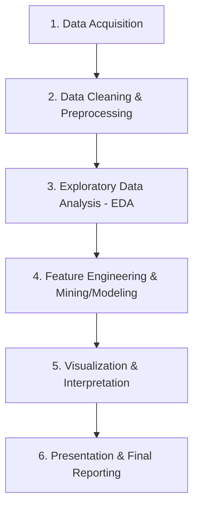

# CienciaDatosDelitosTPO - Crime Data Mining & Analysis

This repository contains the project scaffold and codebase for a university Data Mining and Analysis project focused on crime-related datasets. It is structured to follow industry and academic best practices, encouraging modular code reuse, reproducible environments, and clean separation of concerns.

---

## 1. Project Organization

```text
CienciaDatosDelitosTPO/
├── data/
│   ├── raw/                  # Raw, unmodified source datasets (treat as read-only)
│   └── processed/            # Cleaned, transformed datasets ready for mining & modeling
├── notebooks/                # Jupyter notebooks for interactive development
│   ├── 01_data_cleaning.ipynb         # Data ingestion, formatting, and imputation
│   ├── 02_exploratory_analysis.ipynb  # Basic statistics, distributions, and EDA
│   └── 03_visualizations.ipynb        # Polished, publication-ready figures
├── src/                      # Modular Python source code (keeps notebooks clean)
│   ├── __init__.py           # Makes src a Python package
│   ├── cleaning.py           # Reusable data cleaning routines
│   └── visualization.py      # Reusable plotting code for uniform styles
├── docs/                     # Project documentation & reference sheets
│   ├── data_dictionary.md    # Metadata definitions for schema columns
│   └── references.md         # Data source citations and academic bibliography
├── reports/                  # Deliverables and presentation materials
│   ├── figures/              # Generated high-DPI plots saved for papers/slides
│   └── final_report.md       # Outline/template of the academic project paper
├── .gitignore                # Ensures large datasets & local caches are not tracked
├── requirements.txt          # Python package dependency list
└── README.md                 # Project dashboard & overview (this file)
```

---

## 2. Recommended Data Mining Workflow

To ensure academic rigor and reproducibility, follow this step-by-step workflow:



### Stage 1: Data Acquisition & Storage
*   **Action:** Obtain the raw crime datasets from open portals (e.g., municipal open data, police department reports).
*   **Storage:** Save them in `data/raw/`. Do **not** commit raw files to Git (already configured via `.gitignore` to prevent repository bloat).
*   **Doc:** Detail URLs, retrieval dates, and credentials in [references.md](docs/references.md).

### Stage 2: Data Ingestion & Cleaning
*   **Action:** Load datasets and identify missing variables, duplicate records, structural inconsistencies, and outlier boundaries.
*   **Implementation:** Use [01_data_cleaning.ipynb](notebooks/01_data_cleaning.ipynb) to inspect and clean the data. Write reusable cleaning algorithms in [cleaning.py](src/cleaning.py).
*   **Output:** Export the finalized dataset to `data/processed/` (e.g. `cleaned_crime_data.csv`).

### Stage 3: Exploratory Data Analysis (EDA)
*   **Action:** Generate summary statistics, identify distributions of single variables (e.g., crime types, crime count frequencies), and inspect correlations (e.g., temporal crime patterns, geographic hot-spots).
*   **Implementation:** Conduct analysis in [02_exploratory_analysis.ipynb](notebooks/02_exploratory_analysis.ipynb). Use this phase to formulate research hypotheses (e.g., "Assault incident rates increase significantly during weekend night hours").

### Stage 4: Feature Engineering & Data Mining / Modeling
*   **Action:** Build features (e.g., time-bins, spatial cluster IDs) and apply data mining techniques. Depending on the university assignment, this may involve:
    *   *Clustering:* Grouping spatial coordinates using algorithms like K-Means or DBSCAN to define "Hot Zones".
    *   *Classification:* Applying Decision Trees or Random Forests to predict likelihoods (e.g., predicting if an incident leads to an arrest).
    *   *Association Rule Mining:* Detecting common associations (e.g., "Weapons + Commercial Zones -> Night Shift").

### Stage 5: Polished Visualizations
*   **Action:** Select the most compelling findings from EDA/Modeling and create publication-quality charts.
*   **Implementation:** Use [03_visualizations.ipynb](notebooks/03_visualizations.ipynb) and [visualization.py](src/visualization.py) to render uniform, high-contrast, high-DPI (e.g., 300 DPI) figures.
*   **Output:** Save plots directly to `reports/figures/`.

### Stage 6: Final Reporting & Presentation
*   **Action:** Draft the final academic paper and prepare presentation slides using the generated figures.
*   **Implementation:** Structure your work using the template in [final_report.md](reports/final_report.md), integrating references and figures from the project folder.

---

## 3. Environment Setup & Execution

To set up the development environment, execute the following commands in your terminal:

### 1. Create a Python Virtual Environment
For Windows (PowerShell):
```powershell
python -m venv venv
.\venv\Scripts\Activate.ps1
```

### 2. Install Project Dependencies
Install standard libraries required for data mining and analysis:
```bash
pip install --upgrade pip
pip install -r requirements.txt
```

### 3. Launch Jupyter
Start Jupyter to run the interactive notebooks:
```bash
jupyter notebook
```